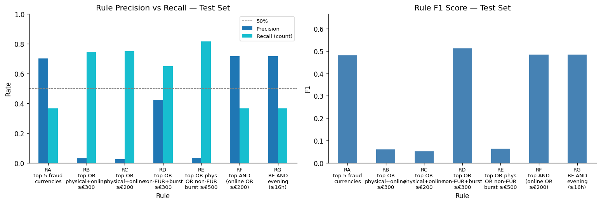
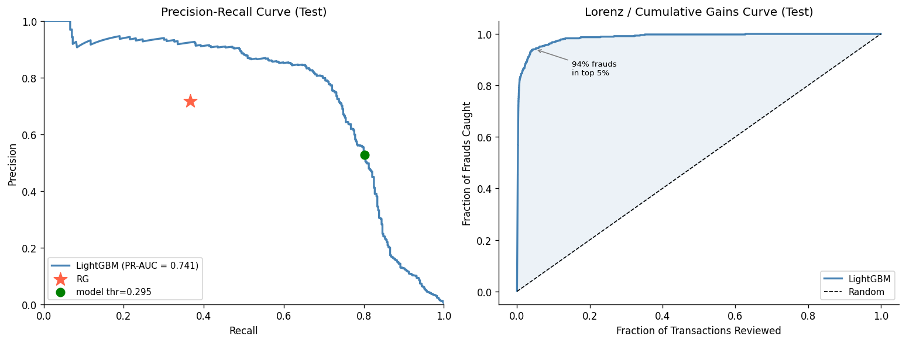
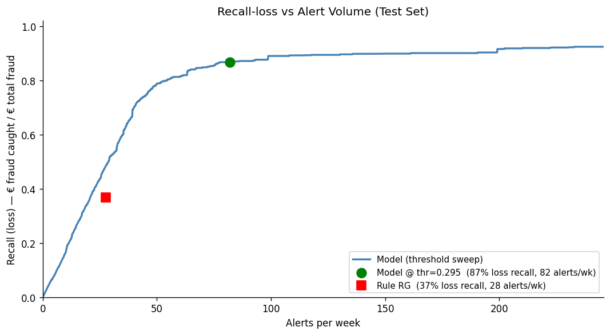
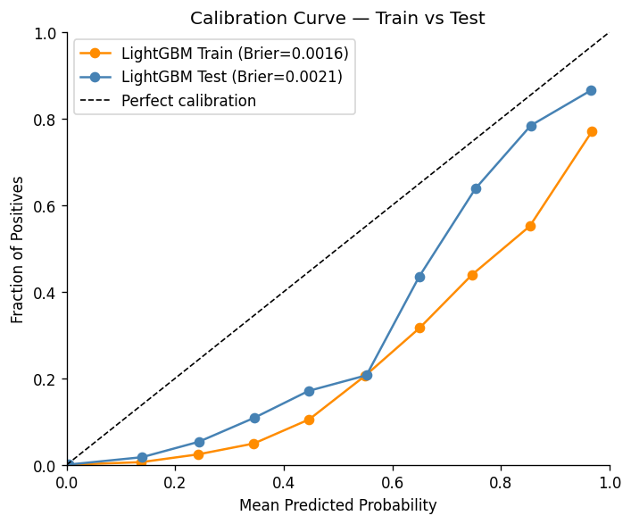
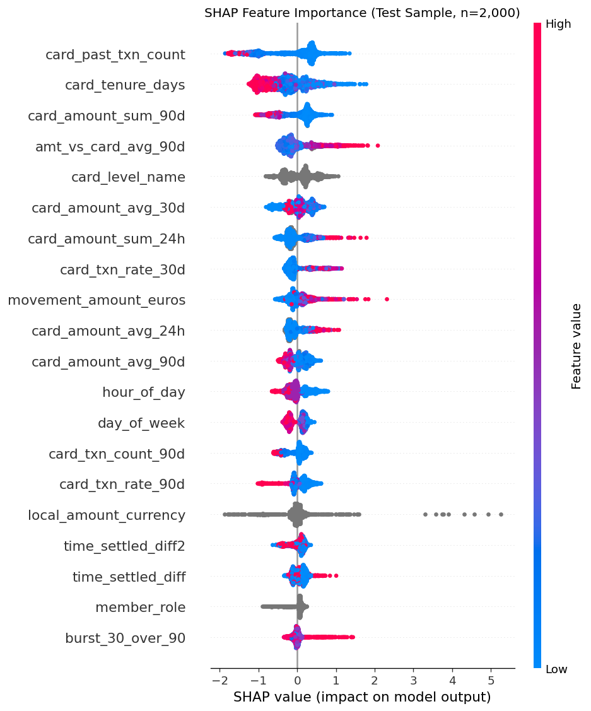
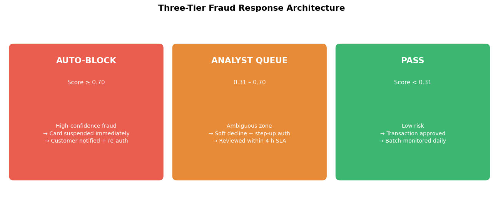

# Qonto — Card Fraud Detection

> Quantitative Risk Analyst business case · Expert rules · LightGBM · Three-tier defense system

---

## Notebooks

| Notebook | Scope |
|---|---|
| [`qonto_eda.ipynb`](qonto_eda.ipynb) | Data loading, quality checks, descriptive analysis, EDA — feature distributions and temporal stability |
| [`qonto_main.ipynb`](qonto_main.ipynb) | Expert rules, feature engineering (rolling windows), LightGBM model, calibration, SHAP, production strategy |

---

## Dataset

| Property | Value |
|---|---|
| Transactions | 587,303 |
| Period | Jan – Dec 2022 |
| Fraud cases | 1,392 **(0.24%)** |
| Total fraud losses | **€877,294** |
| Avg fraud amount | €630 vs €263 legit **(2.4×)** |
| Train split | Jan – Oct 2022 · 470,884 rows · 925 frauds |
| Test split | Nov – Dec 2022 · 116,419 rows · 467 frauds |

Split is **time-based** (not random) to prevent temporal leakage and simulate real deployment conditions.

---

## EDA — Key Findings

- Fraud rate surged from near-zero in Jan–May to **0.8%+ in Aug–Oct**, then held in Nov–Dec
- **4 distinct fraud regimes** identified across 2022 — clear evidence of concept drift
- Two fraud types: **chargebacks** (€846k, positive amounts) and **refund fraud** (€31k, negative amounts)
- 7 exotic currencies carry fraud rates above 5% — the strongest discriminating signal
- Non-EUR currencies, online payments, and high amounts are consistently over-represented in fraud

---

## Expert Rules

Rules derived from bivariate analysis: each feature evaluated independently against `is_fraud` before combining.



**Best rule — RD** (`top_curr OR (non-EUR & burst ≤300s & amount ≥€300)`) achieves the highest F1 on test.

```
IF   local_amount_currency IN top-5 fraud currencies (train-derived)
THEN → ALERT

ELSE IF local_amount_currency != 'EUR'
     AND time_settled_diff <= 300s
     AND abs(movement_amount_euros) >= €300
THEN → ALERT

ELSE → PASS
```

| Metric | Train | Test |
|---|---|---|
| Precision | ~42% | ~42% |
| Recall | ~56% | ~65% |
| F1 | ~0.48 | **~0.51** |
| Alerts / week | ~53 | — |

---

## Feature Engineering

Beyond the raw columns, **rolling window features per card** are computed backward-only (`closed='left'`) to avoid leakage:

| Feature | Description |
|---|---|
| `card_past_txn_count` | Total transactions on the card up to (not including) current |
| `card_tenure_days` | Days since first transaction on the card |
| `card_amount_sum_90d` | Sum of amounts in the last 90 days |
| `card_amount_avg_90d` | Average amount in the last 90 days |
| `amt_vs_card_avg_90d` | Current amount ÷ card 90d average (anomaly ratio) |
| `card_txn_rate_30d` | Transaction count rate in last 30 days |
| `burst_30_over_90` | Ratio of 30d burst rate vs 90d baseline |

> **Leakage sanity check**: first transaction per card must have all rolling counts = 0. Verified in notebook.

---

## LightGBM Model

### Evaluation



- **PR-AUC = 0.741** on test (vs 0.24% baseline)
- **94% of frauds fall in the top 5%** of ranked transactions (Lorenz curve)
- Expert rule RG plotted as reference point on the PR curve

### Recall-Loss vs Alert Volume



| System | Loss recall | Alerts / week |
|---|---|---|
| Rule RG | 37% | 28 |
| **Model @ thr=0.295** | **87%** | **82** |

At 3× the alert volume, the model prevents **2.4× more fraud losses**.

### Calibration



- Train Brier score: **0.0016** · Test Brier score: **0.0021**
- Both curves run **below** the diagonal — the model **overestimates** fraud probability. `scale_pos_weight` inflates predicted scores above true probabilities during training.                              - The test curve sits closer to the diagonal than train because the test fraud rate nearly doubled (0.196% → 0.401%), partially offsetting the overestimation.

**Fix — Isotonic Regression calibration**: fit a monotonic step function on a held-out validation set that maps raw model scores to true probabilities. Unlike Platt scaling (logistic), isotonic regression makes no distributional assumption and handles the non-linear shape visible in the chart. Apply with `CalibratedClassifierCV(model, method='isotonic', cv='prefit')` after model training. Re-calibrate whenever the model is retrained or the fraud rate shifts significantly.
  
### Feature Importance — SHAP



Top drivers (by mean |SHAP|):
1. **`card_past_txn_count`** — new cards with no history are high risk
2. **`card_tenure_days`** — short-lived cards are disproportionately fraudulent
3. **`card_amount_sum_90d`** / **`amt_vs_card_avg_90d`** — amounts far above card baseline
4. **`card_level_name`** — card type encodes fraud risk profile
5. **`local_amount_currency`** — exotic currencies remain a strong signal

---

## Proposed Defense System — Three-Tier Architecture



| Tier | Score | Action |
|---|---|---|
| **AUTO-BLOCK** | ≥ 0.70 | Card suspended immediately · Customer notified + re-auth |
| **ANALYST QUEUE** | 0.31 – 0.70 | Soft decline + step-up auth · Reviewed within 4h SLA |
| **PASS** | < 0.31 | Transaction approved · Batch-monitored daily |

---

## Key Learnings

**1. PR-AUC over ROC-AUC**
At 0.24% fraud rate, ROC-AUC is misleading (random classifier scores 0.5 but has 0% recall). PR-AUC focuses on the minority class and is the right primary metric.

**2. Time-based split is non-negotiable**
Random splits leak future fraud patterns into training. OOT split simulates real deployment and exposes concept drift early.

**3. Rolling window features are the biggest lift**
Raw velocity (`time_settled_diff`) has limited predictive power alone. Card-level behavioral features (`card_tenure_days`, `amt_vs_card_avg_90d`) provide the context that separates genuine anomalies from noise — confirmed by SHAP.

**4. Concept drift is the hardest problem**
Fraud changed character 4 times in 2022. The calibration curve showing test underestimation is a direct consequence. Models need PSI monitoring and rolling retraining, not a one-time fit.

**5. The expert rule is still valuable in production**
The best rule (F1=0.51) achieves this at only 28 alerts/week, with full interpretability and no retraining cost. Used as the AUTO-BLOCK tier, it frees the ML model to focus on ambiguous cases.

**6. Class imbalance needs explicit handling**
`scale_pos_weight = sqrt(neg/pos)` (mild upweighting) outperforms either ignoring imbalance or full ratio weighting. Full ratio causes the model to become overconfident on training fraud cases.

**7. Calibration matters for threshold setting**
A model with PR-AUC=0.741 but poor calibration will produce misleading thresholds. Brier score and calibration curves should be part of every model card.

---

## Requirements

```
pandas
numpy
matplotlib
seaborn
scikit-learn
lightgbm
shap
```
